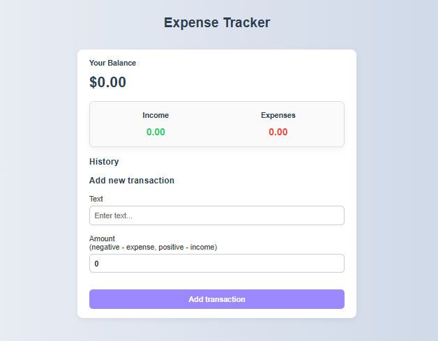

# 💸 Expense Tracker

A modern, responsive and animated React application to track your income and expenses. Built with clean CSS (no frameworks like Tailwind), featuring a dark theme toggle, smooth transitions, and intuitive UI.

## 🚀 Live Demo
👉 [View on GitHub Pages](https://regulusrk.github.io/expense-tracker)  

---

## 📷 Preview

 

---

## ✨ Features

- 💰 Add and remove income or expense transactions
- 📊 Real-time balance calculation
- 🌗 Dark mode toggle (sun/moon icon)
- 💅 Modern CSS styling with:
  - Animations on add/delete
  - Animated "X" delete button
  - Smooth number transition in the balance
- 📱 Fully responsive layout
- 🎨 Clean, professional, accessible design

---

## 🧱 Technologies

- **Node**
- **JavaScript**
- **React**
- **CSS (vanilla)** – no Tailwind, no Bootstrap
- **React Context API** – for global state
- **GitHub Pages** – for deployment

---

## 🗂️ Project Structure

src/
├── components/
│ ├── Header.js
│ ├── Balance.js
│ ├── IncomeExpenses.js
│ ├── TransactionList.js
│ ├── Transactions.js
│ └── AddTransaction.js
├── context/
│ ├── GlobalState.js
│ └── AppReducer.js
├── styles/
│ └── main.css
├── App.js
└── index.js

---

## 🛠️ How to Run Locally

```bash
git clone https://github.com/your-username/expense-tracker.git
cd expense-tracker
npm install
npm start

🌙 Dark Mode
Toggle between light and dark themes using the fixed circle button (🌙 / ☀️) in the top right corner.
Automatically saves preference using localStorage.

📄 License
This project is open-source and available under the MIT License.

🙌 Credits
Built by Rafael with ☕